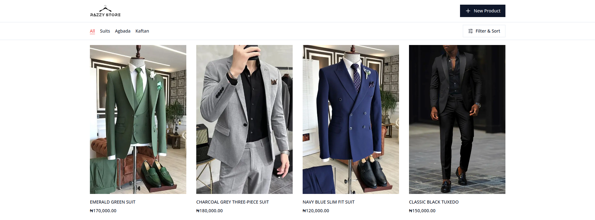
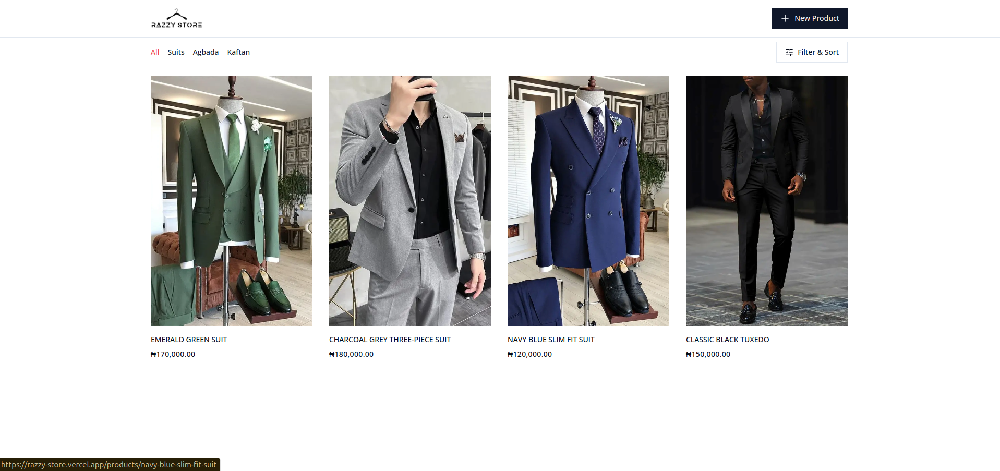
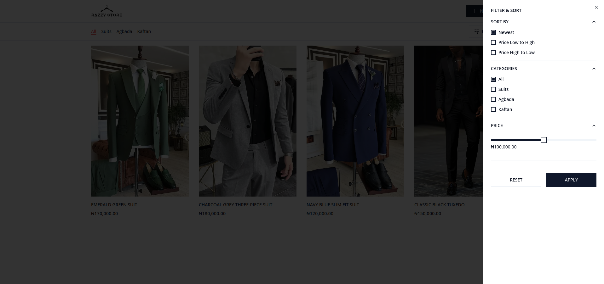
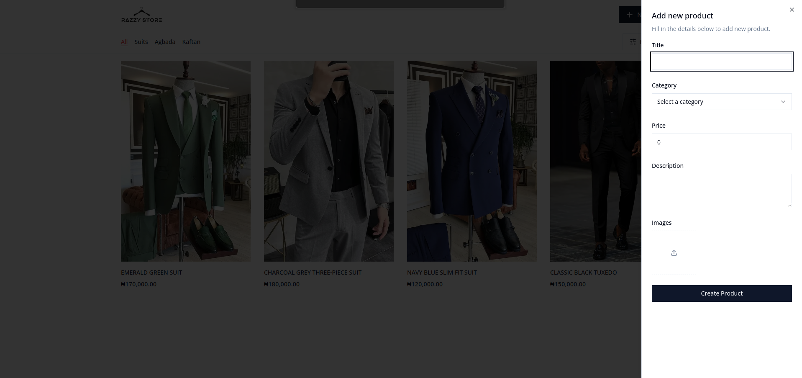
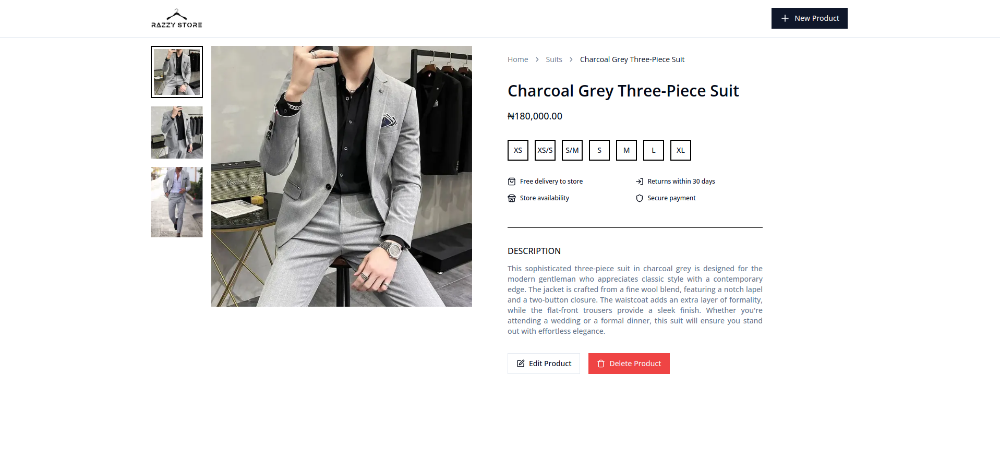
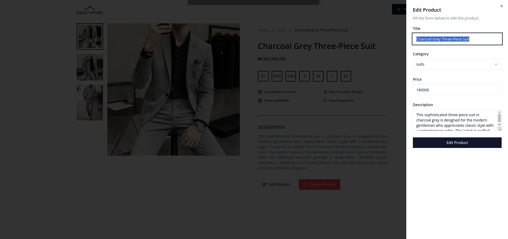

# Razzy Store

Explore vibrant African fashion with our unique collection of traditional and modern designs. Shop authentic Ankara, Kaftans, and more, celebrating culture with quality craftsmanship.

## Table of Contents

- [Installation](#installation)
- [Usage](#usage)
- [API Reference](#api-reference)
- [Features](#features)
- [Design Patterns](#design-patterns)
- [Screenshots](#screenshots)
- [Technologies Used](#technologies-used)
- [Contact Information](#contact-information)
- [Resources](#resources)

## Installation

1. **Clone the repository:**
   ```bash
   git clone https://github.com/razdacoder/razzy-store
   ```
1. **Navigate to the project directory:**
   ```bash
   cd razzy-store
   ```
1. **Install dependencies:**
   ```bash
   npm install
   ```

## Usage

**Run the development server:**

```bash
npm run dev
```

## API Reference


This project got UI inspiration from [Behance](https://www.behance.net/gallery/205316697/Mango-Store-%282024%29?tracking_source=search_projects%7Cfashion+store)

## Features

**Homepage Product List** - Displays a comprehensive list of products, featuring images, name and price.

**Dynamic Product Details** - Each product has a detailed page for more information, including description, and images.

**Filters for different types of products** - See a list and filter by all latest, category and price.

**Responsive Design** - Fully responsive, ensuring a seamless and enjoyable browsing experience on any device.

**Server-side Rendering** - This site leverages NextJS server side rendering for faster load times and greater user experience.

**ShadCN components** - Highly customisable pre built components are featured throught the app.

## Design Patterns

**Maintainability** - I have tried to keep components modular and scalable and dynamic, with an emphasis on reusability and readability.

**Server fetching and formatting** - I am handling fetching and formatting of data on the backend, allowing for tsx components to render data without unnecessary logic or formatting on the front end. I have achieved this by creating dynamic helper functions that process and reformat the data.

**Dynamic fetch function** - I have created two highly flexible server functions to handle all the data fetching necessary for the application.

**Type Safety** - The use of types and interfaces is constant throughout the app, without a single use of the word 'any' to override the type check.

**File and folder structure** - The app is organised to seperate components based on their role, as well as separating types, utils, server functions and constants.

**Saving and committing work often** - I regularly made commits and pull requests to github using a total of 36 pull requests with clear commit messages. This keeps the project organised and allows me to work on tasks without altering the main codebase.

## How SEO was handled

**Static Metadata** - The root metadata defines a default title template ("%s | Razzy Store"), a descriptive summary of the store, relevant keywords, and directives for search engines to index and follow links.

**Dynamic Metadata** - On product pages, metadata is dynamically generated by fetching the product's title and description from the backend, ensuring each page has unique and relevant content for better search engine rankings.

## Screenshots

### Product Listing page



### Product Filter



### Add new product



### Product detail



### Edit product



### Technologies Used


## Contact Information:

[](https://www.linkedin.com/in/razzy-dev/)

[](https://github.com/razdacoder/)

#### Made by Ramon Rasheed Ishola

#### Email: **ramonrash2@gmail.com**

#### Tel: **+234 816 756 2989**

## Resources:

- [Next.js](https://nextjs.org/docs) - Explore the powerful features and API of Next.js.
- [React](https://react.dev/) - Dive deeper into the world of React.,
- [Tailwind](https://v2.tailwindcss.com/docs/) - Master the utility-first approach with Tailwind CSS.
- [ShadCN](https://ui.shadcn.com/docs) - Discover the comprehensive UI components offered by ShadCN.
- [Supabase](https://supabase.com/) - Supabase is an open source Firebase alternative..

### Thank you for reading

I am really grateful for your time and I hope you like what you see here.
